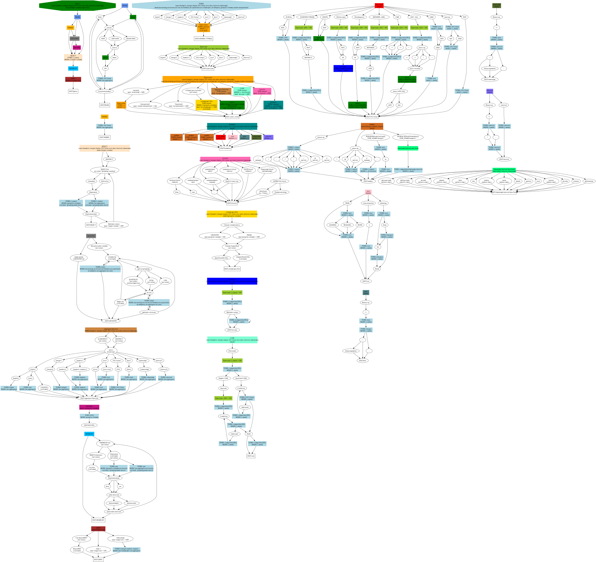

# equivalence_testing

Run `cargo run graph.dot 2` to generate 2 queries using a graph from `graph.dot`.\
\

This query generator is designed to generate large amounts of SQL queries. The aims include
- **Extensibility.** The generator is built to be extencible to dialects other than PostgreSQL. It possesses its own language, build over GraphVIS, that allows to code decision trees in which paths would correspond to SQL code.
- **Speed and validity.** The generator is built to be fast, being able to generate SQL queries that are **always valid**, given table schema.
- **Usability.** The generator produces queries in a form of Abstract Syntactic Trees (ASTs), which are easy to conduct experiments on and possible to be printed out as text.

The project is currently a work in progress, with the current stage concentrated around **constraining** over a given table schema.

## Query generator graph (preview) 

